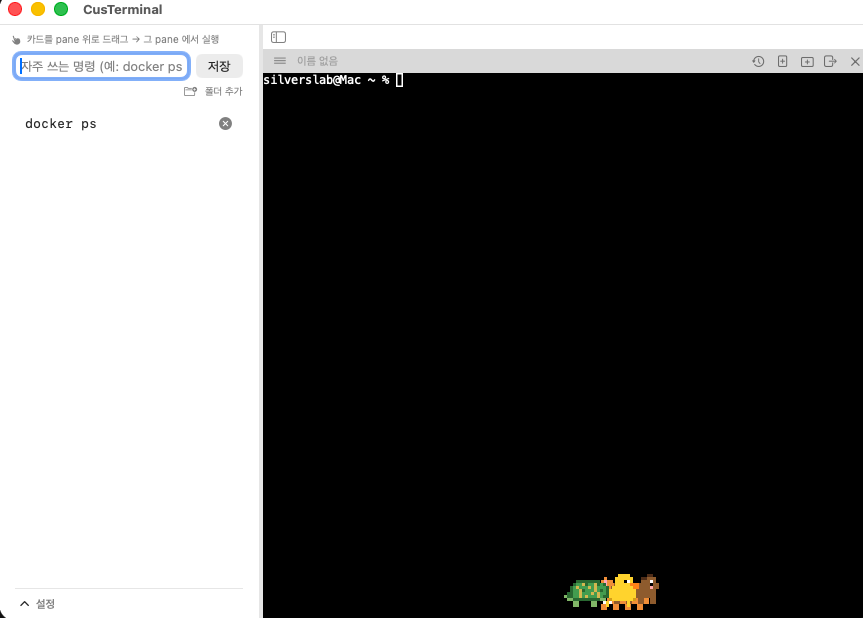
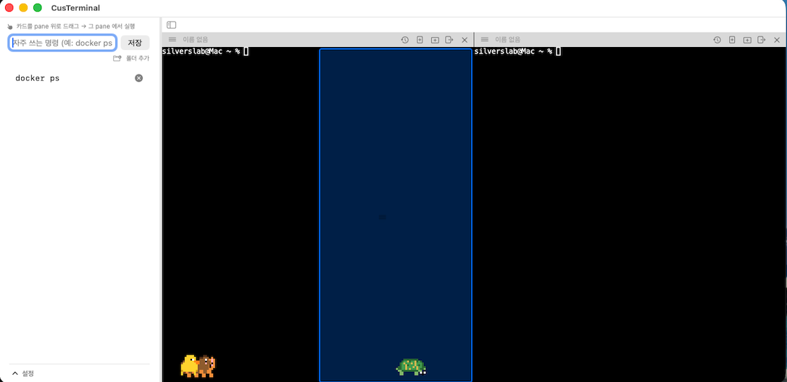
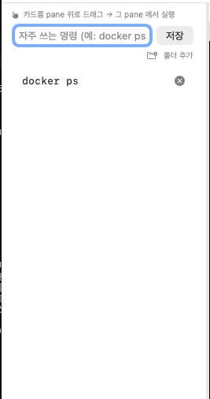
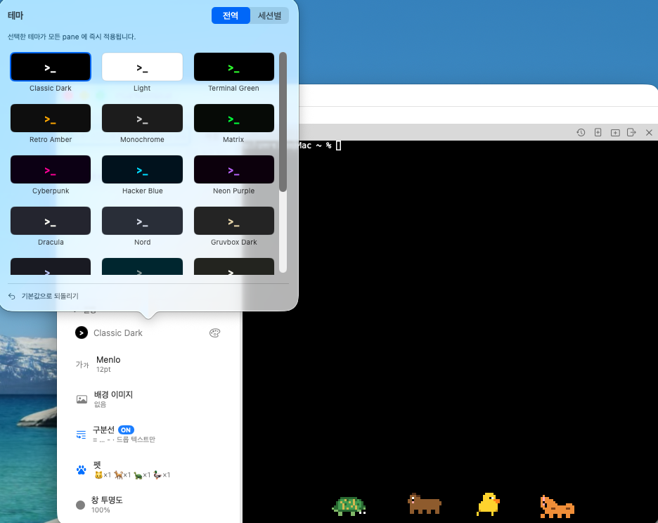
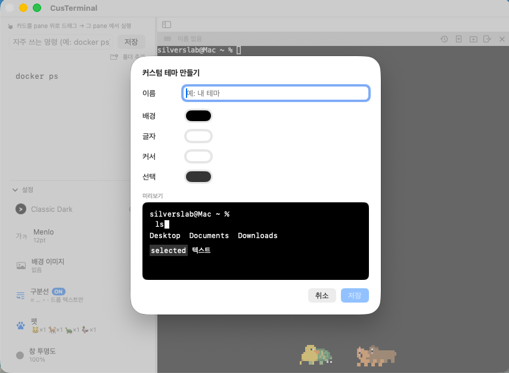
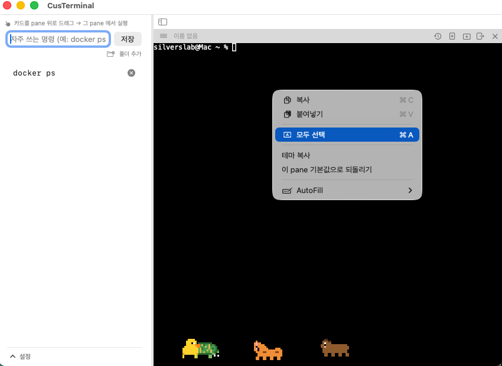

# CusTerminal

**Cus**tom Ter**minal**. 이름부터가 그렇다.
SwiftUI + [SwiftTerm](https://github.com/migueldeicaza/SwiftTerm) 으로 만든 미니 터미널 앱.

> 📸 스크린샷은 `../docs/screenshots/` 밑에 자리만 잡아뒀어요. 파일 채워지면 여기 렌더링됩니다.

<p align="center">
  
</p>

## 이 앱이 하는 것들

- **레이아웃 시트**: 시작 시 가로 × 세로 pane 개수를 stepper 로 지정. 균등/개별 두 모드.
- **드래그 재배치**: pane 헤더 햄버거 잡고 다른 pane 의 **상/하/좌/우** 로 드롭 → 그 방향으로 이동. 세로 ↔ 가로 자유 전환.
- **드롭 미리보기**: IntelliJ 스타일로 들어갈 절반 영역이 반투명 파란색으로 미리 보임.
- **리사이즈**: pane 사이 divider 잡고 드래그.
- **새 창 분리**: pane 을 새 창(NSWindow) 으로 뜯어냄. PTY 세션 유지. 마지막 pane 이면 자리에 새 pane 자동 생성.
- **pane 이름**: 헤더 라벨 더블클릭 → 인라인 편집. 이동/새 창 분리해도 이름 유지. 새 창 타이틀바에도 반영.
- **커맨드 저장/실행**: 왼쪽 사이드바에 커맨드 카드 저장, pane 으로 드래그 & 드롭 → 즉시 실행. 새 창과도 저장소 공유.
- **사이드바 조절**: 폭 드래그 리사이즈 + `⌘B` 로 완전 숨김/보이기.
- **홈에서 시작**: 새 pane 은 `.zshrc` 가 어디로 cd 걸든 상관없이 항상 `~` 에서 시작.
- **테마 시스템**: 프리셋 20종 + 사용자 커스텀. 전역/세션별 모드.
- **우클릭 메뉴**: 터미널 위 우클릭 → 복사 / 붙여넣기 / 모두 선택 (`⌘C`/`⌘V`/`⌘A`).

## 요구사항

- macOS 14+ / Swift 5.9+ (Xcode 15 권장)

## 빌드 & 실행

```bash
cd CusTerminal
./bundle.sh
open .build/release/CusTerminal.app
```

`swift run` 도 가능:
```bash
swift run -c release                       # 시작 시 레이아웃 시트
swift run -c release -- --layout 4,3       # 왼쪽 4행 + 오른쪽 3행 (시트 스킵)
swift run -c release -- --layout 3,3,2     # 3열
```

## 사용법

### 레이아웃 시트

앱 실행 시 뜨는 시트:

- **균등 모드**: 가로(열 수) × 세로(각 열 pane 수) stepper. 모든 열이 같은 pane 수.
- **개별 지정 모드**: 열 개수 조절 + 각 열마다 pane 수 별도. 불균형 배치 (예: `[3, 1, 2]`).
- **하나만 생성**: 단일 pane 창.
- 미리보기 그리드가 실시간 반영.

<p align="center"></p>

### pane 조작

각 pane 헤더:

| 버튼 | 동작 |
|------|------|
| `≡`  | 드래그로 다른 pane 의 상/하/좌/우로 이동 |
| 이름 라벨 | 더블클릭으로 편집 (Enter/Esc) |
| `🎨` | (세션별 테마 모드일 때만) 이 pane 만의 테마 |
| `+ ▤` | 같은 열 아래에 새 pane |
| `+ ▥` | 오른쪽에 새 열 |
| `⇥`  | 이 pane 을 새 창으로 분리 (PTY 유지) |
| `×`  | 이 pane 닫기 |

<p align="center"></p>

### 커맨드 저장 / 불러오기

CusTerminal 창 **왼쪽 사이드바** = 커맨드 저장소.

- **저장**: 사이드바 입력창에 명령 입력 → `Enter` 또는 `저장` 버튼
- **실행**: 저장된 카드를 원하는 터미널 pane 위로 **드래그 & 드롭** → 그 pane 에서 실행
- **삭제**: 카드 오른쪽 `×` 버튼
- **새 창과 공유**: pane 을 새 창으로 분리해도 같은 커맨드 목록이 보임

저장 파일: `CusTerminal/commands.json` (프로젝트 폴더 안, `.gitignore` 처리).

<p align="center"></p>

### 테마

사이드바 하단 팔레트 버튼 → 팝오버:

- **20개 내장 프리셋**: Classic Dark, Light, Terminal Green, Retro Amber, Monochrome, Matrix, Cyberpunk, Hacker Blue, Neon Purple, Dracula, Nord, Gruvbox Dark, Tokyo Night, Solarized Dark, Monokai, Peach Soft, Sakura, Mint Cream, Lavender Dream, Bubblegum
- **전역 / 세션별 모드 세그먼트**
- **커스텀 테마 편집기**: 이름 + 4색(배경/글자/커서/선택) 을 Colors 창에서 실시간 편집. 시트 닫으면 Colors 창도 함께 닫힘.
- 커스텀 테마 우클릭 → 편집/삭제

저장 파일: `CusTerminal/theme.json` (전역 설정), `CusTerminal/custom-themes.json` (커스텀 정의). 둘 다 `.gitignore` 처리.

<p align="center">
  
  
</p>

### 우클릭 메뉴

터미널 위 우클릭 → **복사** / **붙여넣기** / **모두 선택**. `⌘C` / `⌘V` / `⌘A` 도 됨.

<p align="center"></p>

## 앞으로 추가할 것들

- [x] 테마 시스템 (프리셋 + 커스텀)
- [x] 우클릭 컨텍스트 메뉴
- [ ] 폰트 종류 / 크기 설정
- [ ] 명령 히스토리 시간순 검색 (`⌘R`) + 카드로 승격
- [ ] 스크롤백 텍스트 검색 (`⌘F`) + 하이라이트 점프
- [ ] 꾸미기 요소 (마스코트, 배경 이미지/투명도)

## 파일 구조

- `Package.swift` — SwiftTerm 의존성
- `bundle.sh` — `swift build` 결과를 `.app` 번들로 감싸는 스크립트 (ad-hoc 서명 포함)
- `make-icon.swift` / `make-icns.sh` — 앱 아이콘 생성
- `Sources/CusTerminal/`
  - `CusTerminalApp.swift` — 앱 진입점
  - `ContentView.swift` — 메인 창 (사이드바 + pane 컨테이너 + 레이아웃 시트)
  - `LayoutStore.swift` — pane 트리 상태 + 조작 API (add/remove/move/detach)
  - `SplitContainer.swift` — `NSSplitView` 래퍼 (리사이즈 가능한 분할)
  - `SidebarLayout.swift` — 사이드바 폭 조절 + 토글
  - `TerminalPane.swift` — SwiftTerm PTY 어댑터
  - `DragBridge.swift` — AppKit 드래그/드롭 브릿지 (햄버거 소스, 4방향 드롭 오버레이)
  - `DetachedWindow.swift` — pane 을 새 창으로 분리
  - `Command.swift` / `CommandListView.swift` — 저장 커맨드 모델 + 사이드바 UI
  - `Theme.swift` / `ThemeStore.swift` — 테마 모델 + 20종 프리셋 + 전역/세션별 관리
  - `CustomThemeStore.swift` — 사용자 커스텀 테마 저장
  - `ThemePicker.swift` — 팔레트 팝오버 + 커스텀 편집기
  - `ColorWell.swift` — NSColorWell 브릿지
  - `TerminalContextMenu.swift` — 우클릭 복사/붙여넣기/모두 선택
