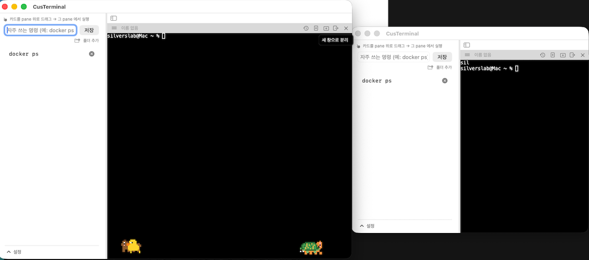

<p align="center">
  
</p>

<h1 align="center">CusTerminal</h1>

<p align="center"><b>Cus</b>tom Ter<b>minal</b>. The name says it all.</p>

<p align="center">
  <a href="#english">English</a> · <a href="#한국어">한국어</a>
</p>

> 📸 스크린샷은 `docs/screenshots/` 밑에 자리만 잡아뒀어요. 파일 채워지면 자동으로 여기 렌더링됩니다.

<!-- MAIN SCREENSHOT -->
<p align="center">
  
</p>

---

## English

A small macOS terminal app to fix the little papercuts I ran into every day.
Two pieces:

- **`layout` shell function** — auto-splits iTerm2 windows
- **`CusTerminal`** — my own tiny SwiftUI + [SwiftTerm](https://github.com/migueldeicaza/SwiftTerm) terminal app

### What used to bug me → What I did about it

1. **Manually splitting a window into 4×3 every time was annoying.**
   → `layout 4 3` from anywhere. GUI dialog if you prefer clicking.

2. **Typing/recalling the same long commands over and over was painful.**
   → CusTerminal's left sidebar keeps them as cards. **Drag a card onto any pane → runs immediately.** No memorizing.
   <p align="center"></p>

3. **I wanted a lightweight terminal that only does "split + saved commands".**
   → That's `CusTerminal`. Use your usual terminal too, or side by side.

4. **"Just move THIS pane over there" was never really possible.**
   → Grab a pane header's hamburger and drop it on another pane's **top/bottom/left/right** edge. IntelliJ-style highlight shows where it'll go.
   <p align="center"></p>

5. **Switching between vertical and horizontal layouts should just work.**
   → The drag freely mixes rows and columns. Empty columns are auto-removed.

6. **Fixed pane sizes felt cramped.**
   → Grab the divider between panes to resize freely.

7. **"Rip this pane into its own window on the second monitor."**
   → "Detach to new window" button in the pane header. **PTY session stays alive.**
   If it was the last pane, a fresh one takes its place. Detached windows share the same command sidebar.
   <p align="center"></p>

8. **New panes should always start at $HOME.**
   → Every new pane auto-runs `cd ~ && clear` right after startup.

9. **After a while I forget which pane is doing what.**
   → Double-click the label in the pane header to rename inline. The name follows the pane around (drag, detach) and shows up in detached-window titles.

10. **Right-click for copy/paste.**
    → Right-click inside the terminal → copy / paste / select all. Also `⌘C` / `⌘V` / `⌘A`.
    <p align="center"></p>

11. **Themes — 20 presets + build your own.**
    → Palette button in the sidebar bottom. 20 built-in themes (Classic Dark, Terminal Green, Matrix, Dracula, Nord, Tokyo Night, Sakura, Bubblegum…) + custom editor.
    Switch between **Global** (one theme for all panes) and **Per-pane** (each pane its own theme) via a segmented toggle.
    <p align="center">
      
      
    </p>

12. **Custom layout dialog.**
    → Startup sheet with a uniform mode (H × V steppers) and a custom mode (per-column pane count). Live preview grid + "single pane" shortcut.
    <p align="center"></p>

### Download

**Just want the app?** From the [Releases page](../../releases):

1. Grab the latest `CusTerminal-vX.Y.Z.dmg`
2. Double-click the DMG → drag `CusTerminal.app` into `Applications`
3. First launch: right-click the app → **Open**
4. If macOS says "damaged": `xattr -dr com.apple.quarantine /Applications/CusTerminal.app`

(Unsigned app — no Apple Developer ID cost. It's ad-hoc signed only.)

### Build from source

```bash
git clone https://github.com/tmdwls2805/CusTerminal.git
cd CusTerminal

# (Optional) install the layout shell function for iTerm splitting
./install.sh
source ~/.zshrc

# Build the CusTerminal app
cd CusTerminal
./bundle.sh
open .build/release/CusTerminal.app
```

**Wire `layout` up to CusTerminal:**
```bash
# add to ~/.zshrc:
export CUSTERMINAL_APP="$HOME/…/CusTerminal/CusTerminal/.build/release/CusTerminal.app"

layout 4 3   # opens in CusTerminal instead of iTerm
```

### Requirements
- macOS 14+
- (Source build only) Swift 5.9+, Xcode 15 recommended

### Roadmap
- [x] Pane split / drag / detach
- [x] Custom pane names
- [x] Command sidebar with drag-to-run
- [x] Theme system (20 presets + custom)
- [x] Right-click copy / paste
- [ ] Font family / size settings
- [ ] Time-sorted command history search (`⌘R`), promote to a saved card
- [ ] Scrollback text search (`⌘F`) with jump-to-match
- [ ] Little decorations (mascots, background image/opacity)

### Making a release (maintainer)
```bash
./release.sh v0.1.3            # publish
./release.sh v0.1.3 --draft    # preview first
```
Requires `gh` CLI. Builds → ad-hoc signs → creates DMG → uploads to GitHub Release with English+Korean notes.

---

## 한국어

터미널을 매일 쓰면서 마주친 자잘한 불편함들을 내 취향에 맞게 커스텀한 도구.
두 가지로 구성:

- **`layout` 셸 함수** — iTerm2 창을 자동 분할
- **`CusTerminal`** — SwiftUI + [SwiftTerm](https://github.com/migueldeicaza/SwiftTerm) 로 만든 미니 터미널 앱

### 뭐가 불편했나 → 어떻게 바꿨나

1. **매번 창을 4×3 이렇게 손으로 나누는 게 귀찮았다**
   → `layout 4 3` 한 줄. GUI 다이얼로그도 있어 마우스로도 됨.

2. **자주 쓰는 긴 커맨드를 매번 치거나 위 화살표로 뒤지는 게 싫었다**
   → CusTerminal 왼쪽 사이드바에 카드로 저장. **카드를 pane 에 드래그 → 즉시 실행.** 외울 필요 없음.
   <p align="center"></p>

3. **"분할 + 저장 커맨드" 만 있는 가벼운 터미널이 있으면 좋겠다**
   → `CusTerminal`. 익숙한 터미널 그대로 써도 되고, 함께 써도 됨.

4. **"이 pane 만 옆으로 옮기고 싶다" 를 하고 싶었다**
   → pane 헤더 햄버거를 잡고 다른 pane 의 **상/하/좌/우** 로 드래그. IntelliJ 스타일 미리보기 하이라이트로 어디 들어갈지 보임.
   <p align="center"></p>

5. **세로 → 가로 자유 전환**
   → 위 드래그가 열↔행 자유 이동. 원래 열이 비면 자동 제거.

6. **pane 크기 자유롭게 조절**
   → pane 사이 divider 드래그.

7. **"이 창만 따로 뜯어 다른 모니터에 두고 싶다"**
   → 헤더의 "새 창으로 분리" 버튼. PTY 세션 유지. 마지막 pane 이면 자리에 새 pane 자동 생성. 새 창도 커맨드 사이드바 공유.
   <p align="center"></p>

8. **새 pane 은 항상 홈에서 시작**
   → 새 pane 시작 직후 `cd ~ && clear` 자동 실행.

9. **어느 pane 이 뭐 하는지 나중에 헷갈린다**
   → 헤더 이름 라벨 더블클릭 → 인라인 편집. 이동/분리해도 이름 유지. 새 창 타이틀에도 반영.

10. **우클릭으로 복사/붙여넣기**
    → 터미널 위 우클릭 → 복사 / 붙여넣기 / 모두 선택. `⌘C` / `⌘V` / `⌘A` 도 됨.
    <p align="center"></p>

11. **테마 — 프리셋 20개 + 커스텀 편집**
    → 사이드바 하단 팔레트 버튼. Classic Dark, Terminal Green, Matrix, Dracula, Nord, Tokyo Night, Sakura, Bubblegum 등 20종 내장 + 사용자 커스텀.
    **전역 모드** (모든 pane 이 같은 테마) 와 **세션별 모드** (각 pane 개별 테마) 를 세그먼트로 전환.
    커스텀 편집기는 이름 + 4색(배경/글자/커서/선택) 을 Colors 창에서 실시간 반영, 시트 닫으면 Colors 창도 함께 닫힘.
    <p align="center">
      
      
    </p>

12. **레이아웃 다이얼로그**
    → 시작 시트에서 균등 모드 (가로 × 세로 stepper) 와 개별 모드 (열마다 pane 수 지정) 선택. 실시간 미리보기 그리드 + "하나만 생성" 버튼.
    <p align="center"></p>

### 다운로드

**앱만 쓰고 싶으면** [Releases 페이지](../../releases) 에서:

1. 최신 `CusTerminal-vX.Y.Z.dmg` 다운로드
2. DMG 더블클릭 → `CusTerminal.app` 을 `Applications` 폴더로 드래그
3. 첫 실행: 앱 우클릭 → **열기**
4. "손상되어 열 수 없습니다" 뜨면: `xattr -dr com.apple.quarantine /Applications/CusTerminal.app`

(서명 안 된 앱 — Apple Developer 인증 없음. ad-hoc 서명만.)

### 소스에서 직접 빌드

```bash
git clone https://github.com/tmdwls2805/CusTerminal.git
cd CusTerminal

# (선택) iTerm 자동 분할용 layout 셸 함수 설치
./install.sh
source ~/.zshrc

# CusTerminal 앱 빌드
cd CusTerminal
./bundle.sh
open .build/release/CusTerminal.app
```

**`layout` 함수와 연동:**
```bash
# ~/.zshrc 에 추가:
export CUSTERMINAL_APP="$HOME/…/CusTerminal/CusTerminal/.build/release/CusTerminal.app"

layout 4 3   # iTerm 대신 CusTerminal 로 열림
```

### 요구사항
- macOS 14+
- (소스 빌드 시) Swift 5.9+, Xcode 15 권장

### 로드맵
- [x] pane 분할 / 드래그 / 분리
- [x] pane 이름 라벨
- [x] 커맨드 사이드바 + 드래그 실행
- [x] 테마 시스템 (프리셋 20종 + 커스텀)
- [x] 우클릭 복사 / 붙여넣기
- [ ] 폰트 종류 / 크기 설정
- [ ] 명령 히스토리 시간순 검색 (`⌘R`), 자주 쓰는 건 카드로 승격
- [ ] 스크롤백 텍스트 검색 (`⌘F`) + 하이라이트 점프
- [ ] 꾸미기 (마스코트, 배경 이미지/투명도)

### 릴리즈 만들기 (관리자용)
```bash
./release.sh v0.1.3            # 정식
./release.sh v0.1.3 --draft    # 미리보기
```
`gh` CLI 필요. 빌드 → ad-hoc 서명 → DMG → GitHub Release (영문+한국어 노트) 자동 생성.
