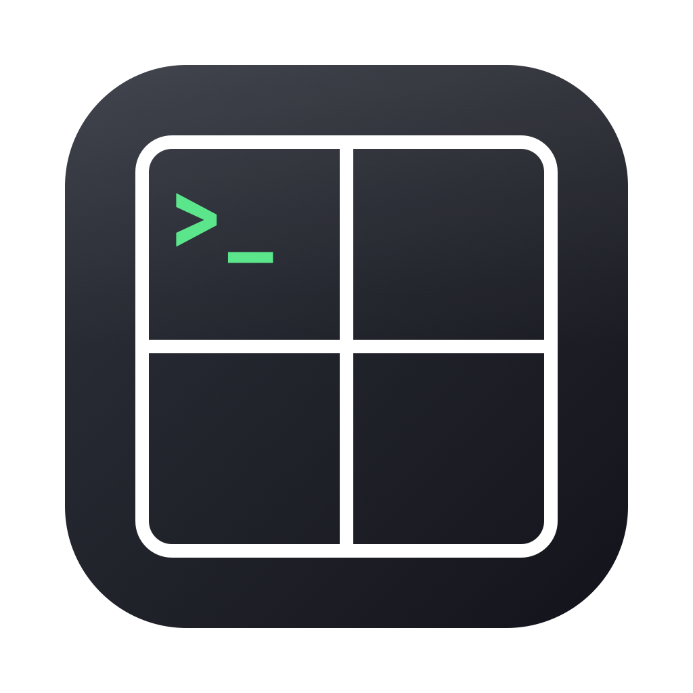

<p align="center">
  
</p>

<h1 align="center">CusTerminal</h1>

<p align="center"><b>Cus</b>tom Ter<b>minal</b>. The name says it all.</p>

<p align="center">
  <a href="#english">English</a> · <a href="#한국어">한국어</a>
</p>

---

## English

A small macOS terminal app I made to fix the little papercuts I ran into every day.
Comes with two pieces:

- **`layout` shell function** — auto-splits iTerm2 windows
- **`CusTerminal`** — my own tiny SwiftUI + [SwiftTerm](https://github.com/migueldeicaza/SwiftTerm) terminal app

### What used to bug me → What I did about it

1. **Manually splitting a window into 4×3 every time was annoying.**
   → `layout 4 3` from anywhere. Or use the GUI dialog if you prefer clicking.

2. **Typing/recalling the same long commands over and over was painful.**
   → CusTerminal's left sidebar keeps them as cards. **Drag a card onto any pane → runs immediately.** No memorizing.

3. **I wanted a lightweight terminal that only does "split + saved commands".**
   → That's `CusTerminal`. Use your usual terminal too, or side by side. Up to you.

4. **"Just move THIS pane over there" was never really possible.**
   → Grab a pane header's hamburger and drop it on another pane's **top/bottom/left/right** edge. IntelliJ-style highlight shows where it'll go.

5. **Switching between vertical and horizontal layouts should just work.**
   → The above drag freely mixes rows and columns. Empty columns are auto-removed.

6. **Fixed pane sizes felt cramped.**
   → Grab the divider between panes to resize freely.

7. **"Rip this pane into its own window on the second monitor."**
   → "Detach to new window" button in the pane header. **PTY session stays alive.**
   If it was the last pane, a fresh one takes its place so the original window isn't left empty.
   Detached windows share the same command sidebar.

8. **New panes should always start at $HOME.**
   → Every new pane auto-runs `cd ~ && clear` right after startup, regardless of what your `.zshrc` does.

9. **After a while I forget which pane is doing what.**
   → Double-click the label in the pane header to rename inline. The name follows the pane around (drag, detach) and shows up in detached-window titles.

10. **Right-click for copy/paste.**
    → Right-click inside the terminal → copy / paste / select all. Also `⌘C` / `⌘V` / `⌘A`.

### Download

**Just want the app?** Download from the [Releases page](../../releases):

1. Grab the latest `CusTerminal-vX.Y.Z.dmg`
2. Double-click the DMG → drag `CusTerminal.app` into the `Applications` folder
3. First launch: right-click the app → **Open** (unsigned app, only needed once)

### Build from source

```bash
git clone https://github.com/tmdwls2805/CusTerminal.git
cd CusTerminal

# (Optional) install the layout shell function for iTerm splitting
./install.sh
source ~/.zshrc

# Build the CusTerminal app
cd CusTerminal
./bundle.sh
open .build/release/CusTerminal.app
```

**Wire `layout` up to CusTerminal:**
```bash
# add to ~/.zshrc:
export CUSTERMINAL_APP="$HOME/…/CusTerminal/CusTerminal/.build/release/CusTerminal.app"

layout 4 3   # opens in CusTerminal instead of iTerm
```

### Requirements
- macOS 14+
- (Source build only) Swift 5.9+, Xcode 15 recommended

### Roadmap
- [ ] Color / theme / font settings (with Solarized · Dracula presets)
- [ ] Time-sorted command history search (`⌘R`), promote to a saved card
- [ ] Scrollback text search (`⌘F`) with jump-to-match
- [ ] Little decorations (mascots, background image/opacity)

### Making a release (maintainer)
```bash
./release.sh v0.1.1            # publish
./release.sh v0.1.1 --draft    # preview first
```
Requires `gh` CLI. Builds, packages the app into a DMG, creates the GitHub Release.

---

## 한국어

터미널을 매일 쓰면서 계속 마주치던 자잘한 불편함들을 하나씩 내 취향에 맞게 커스텀한 도구.
두 가지로 구성:

- **`layout` 셸 함수** — iTerm2 창을 자동 분할
- **`CusTerminal`** — SwiftUI + [SwiftTerm](https://github.com/migueldeicaza/SwiftTerm) 로 만든 미니 터미널 앱

### 뭐가 불편했나 → 어떻게 바꿨나

1. **매번 창을 4×3 이렇게 손으로 나누는 게 귀찮았다**
   → `layout 4 3` 한 줄로 원하는 분할. GUI 다이얼로그도 있어 마우스로도 됨.

2. **자주 쓰는 긴 커맨드를 매번 치거나 위 화살표로 뒤지는 게 싫었다**
   → CusTerminal 왼쪽 사이드바에 카드로 저장. **카드를 pane 에 드래그 → 즉시 실행**. 외울 필요 없음.

3. **딱 "분할 + 저장 커맨드" 만 있는 가벼운 터미널이 있으면 좋겠다**
   → `CusTerminal`. 익숙한 터미널을 계속 써도 되고, 함께 써도 됨.

4. **"이 pane 만 옆으로 옮기고 싶다" 를 하고 싶었다**
   → pane 헤더 햄버거를 잡고 다른 pane 의 **상/하/좌/우** 로 드래그. IntelliJ 스타일 미리보기 하이라이트로 어디 들어갈지 보임.

5. **세로 → 가로 자유 전환**
   → 위 드래그가 열↔행 사이 자유 이동. 원래 열이 비면 자동 제거.

6. **pane 크기 자유롭게 조절**
   → pane 사이 divider 드래그.

7. **"이 창만 따로 뜯어 다른 모니터에 두고 싶다"**
   → 헤더의 "새 창으로 분리" 버튼. PTY 세션 유지된 채 새 창으로. 마지막 pane 이었으면 자리에 새 pane 자동 생성. 새 창도 커맨드 사이드바 공유.

8. **새 pane 은 항상 홈에서 시작**
   → 새 pane 시작 직후 `cd ~ && clear` 자동 실행. `.zshrc` 가 어디로 cd 걸든 홈에서 시작.

9. **어느 pane 이 뭐 하는지 나중에 헷갈린다**
   → 헤더 이름 라벨 더블클릭 → 인라인 편집. 이동/분리해도 이름 유지. 새 창 타이틀에도 반영.

10. **우클릭으로 복사/붙여넣기**
    → 터미널 위 우클릭 → 복사 / 붙여넣기 / 모두 선택. `⌘C` / `⌘V` / `⌘A` 도 됨.

### 다운로드

**앱만 쓰고 싶으면** [Releases 페이지](../../releases) 에서:

1. 최신 `CusTerminal-vX.Y.Z.dmg` 다운로드
2. DMG 더블클릭 → `CusTerminal.app` 을 `Applications` 폴더로 드래그
3. 첫 실행: 앱 우클릭 → **열기** (서명 안 된 앱이라 한 번만 필요)

### 소스에서 직접 빌드

```bash
git clone https://github.com/tmdwls2805/CusTerminal.git
cd CusTerminal

# (선택) iTerm 자동 분할용 layout 셸 함수 설치
./install.sh
source ~/.zshrc

# CusTerminal 앱 빌드
cd CusTerminal
./bundle.sh
open .build/release/CusTerminal.app
```

**`layout` 함수와 연동:**
```bash
# ~/.zshrc 에 추가:
export CUSTERMINAL_APP="$HOME/…/CusTerminal/CusTerminal/.build/release/CusTerminal.app"

layout 4 3   # iTerm 대신 CusTerminal 로 열림
```

### 요구사항
- macOS 14+
- (소스 빌드 시) Swift 5.9+, Xcode 15 권장

### 로드맵
- [ ] 색상 / 테마 / 폰트 설정 시트 (Solarized · Dracula 프리셋)
- [ ] 명령 히스토리 시간순 검색 (`⌘R`), 자주 쓰는 건 카드로 승격
- [ ] 스크롤백 텍스트 검색 (`⌘F`) + 하이라이트 점프
- [ ] 꾸미기 (마스코트, 배경 이미지/투명도)

### 릴리즈 만들기 (관리자용)
```bash
./release.sh v0.1.1            # 정식
./release.sh v0.1.1 --draft    # 미리보기
```
`gh` CLI 필요. 빌드 → DMG → GitHub Release 자동 생성.
